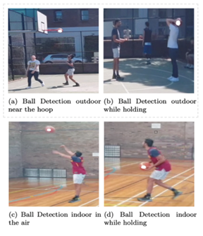
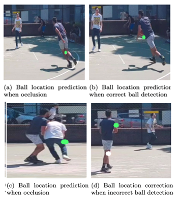

# cs9517-Skynet-Project: 
To create a softare that can track the score of a basketball game using a mobile camera, while considering the point difference of different shots i.e 2 pointers and 3 pointers

## Instruction

### Selecting basketball court boundary
An image of the first frame of the video will be displayed for the user to select the corners of the basketball court. 
In a clockwise direction, starting at the top left hand corner, double click the left mouse button to select the corners of the court.
Padding has been provided if the full court cannot be seen in the frame.

### Selecting basketball hoop at the beginning
When you execute the basketball.py file, it will ask you to select an ROI of the basketball hoop. You need to draw a rectangle around the red basketball hoop and press 'enter'

## Results

### Detection of ball
The accuracy of the detection of the ball is displayed in the image before and has been marked with **_white pixels_** in figure 1.

Figure 1: Ball Detection

### Detection of ball combined with Extended Kalman Filter
The EKF (extended kalman filter) is type of sensor data fusion technique for estimating position using gaussian statistics given information from a sensor with some a set confidence. It is used in this project to handle occlusion where the ball is not visible, we are able to calculate a good prediction for the position of the ball using previous data. The detection of the ball is marked with **_white pixels_** and the EKF predictions with **_green pixels_** in figure 2.

Figure 2: Ball Detection with EKF

### Person Detection and Tracking 
Figure 3 displays the scenarios in which the detection ad tracking algorithm work in. The positions of the players are necessary to idetify if the shot is a 2 pointer or a 3 pointer shot. The detection algorthm and tracking results are displayed with the **_green rectangle_** and the **_purple rectangle_** respectively.

Figure 3: Person Tracking

### Perspective Transform
The perspective transform is used to convert the person's position from image frame of reference to the frame of reference of the court. This is demonstrated using the blue dots marked in figure 4.

Figure 4: Perspective Transform
  
